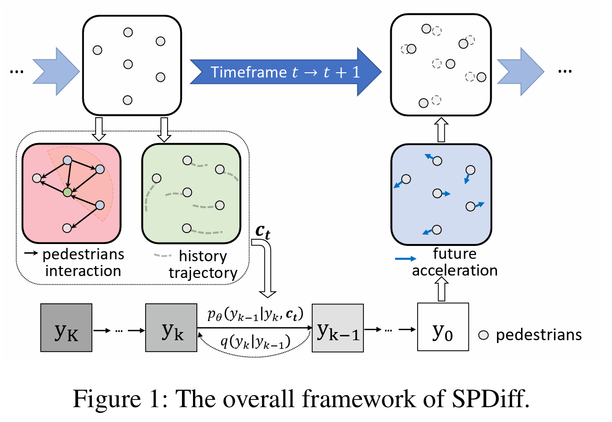

# Implementation of AAAI2024 Paper: Social Physics Informed Diffusion Model for Crowd Simulation (await completion)

## Overview


In this paper, we propose a social physics-informed diffusion model named SPDiff to bridge the gap in crowd simulation. SPDiff leverages both the interactive and historical information of crowds in the current timeframe to reverse the diffusion process, thereby generating the distribution of pedestrian movement in the subsequent timeframe. Inspired by the well-known Social Force model in social physics regarding crowd dynamics, we design a crowd interaction module to guide the denoising process and further enhance this module with the equivariant properties of crowd interactions. To mitigate error accumulation in long-term simulations, we propose a multi-frame rollout training algorithm for diffusion modeling.

This project was described in the research article on conference AAAI2024.

The pdf link can be found at https://arxiv.org/abs/2402.06680.

## Installation
### Environment
- os: Linux
- Python >= 3.7
- Pytorch = 1.7.1

## Dataset
We conduct crowd simulation evaluation experiments of the model on two open-source datasets: the GC and the UCY datasets. Following the approach of PCS (Zhang et al. 2022), we select trajectory data with rich pedestrian interactions (> 200 pedestrians per minute) of 300s duration from the GC dataset and 216s duration from the UCY dataset for training and testing.
The data is located in data_origin/GC_dataset and data_origin/UCY_dataset.

## Usage

To run the model on the GC dataset, use the following command:
```bash
CUDA_VISIBLE_DEVICES=[GPU_USED] python main.py --config configs/gc.yaml
```
For the UCY dataset, use:
```bash
CUDA_VISIBLE_DEVICES=[GPU_USED] python main.py --config configs/ucy.yaml
```

More parameters can be tuned in the corresponding YAML configuration files.
